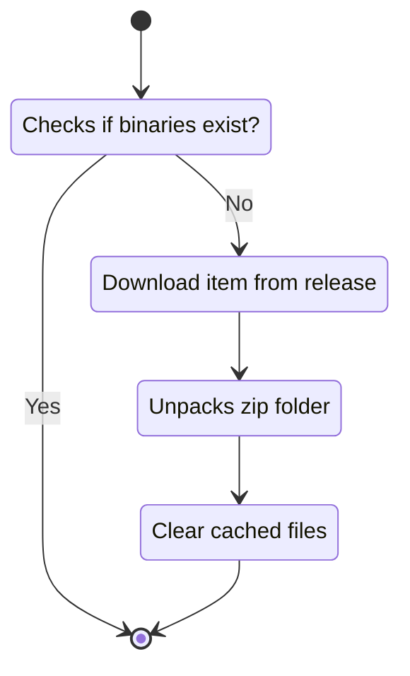

<h1 align="center">Python Plugin</h1>

<p align="center">
    <a href="https://github.com/seekers-dev/python-plugin/actions/workflows/gradle.yml">
        
    </a>
    
    
    
</p>

The python plugin is a plugin for the seekers server that enables client hosting from python files.

## Get from release

There is currently no release, please wait.

## Build on your own

### Get this project

Download the zip file of this property 

### Modify resources

Go to `src/main/resources/org/seekers/python`. There you can find multiple config files.
You can change the release page at `release-page.txt`. This file defines an url from which this plugin will download the seekers python binary.
At `exec-command.txt`, you can set command it will use to run a file.
Both files use properties. You can find these properties at `settings.properties`. Every property is wrapped with brackets (`{}`).
If you add a property in the settings, it will automatically be added for the other config files.
Note that `{file}` is automatically declared and defines the input python file. You should not override this property name.

### Install java

The build requires java.

Linux:
```shell
sudo apt install default-jre
```

Windows: https://www.java.com/en/download/windows_manual.jsp

### Create jar

You can now create your custom build of this property with the following command.

Linux:
```shell
bash ./gradlew jar
```

Windows:
```batch
./gradlew.bat
```

That's it! You can find your jar file at `build/libs`.

## Lifecycle

